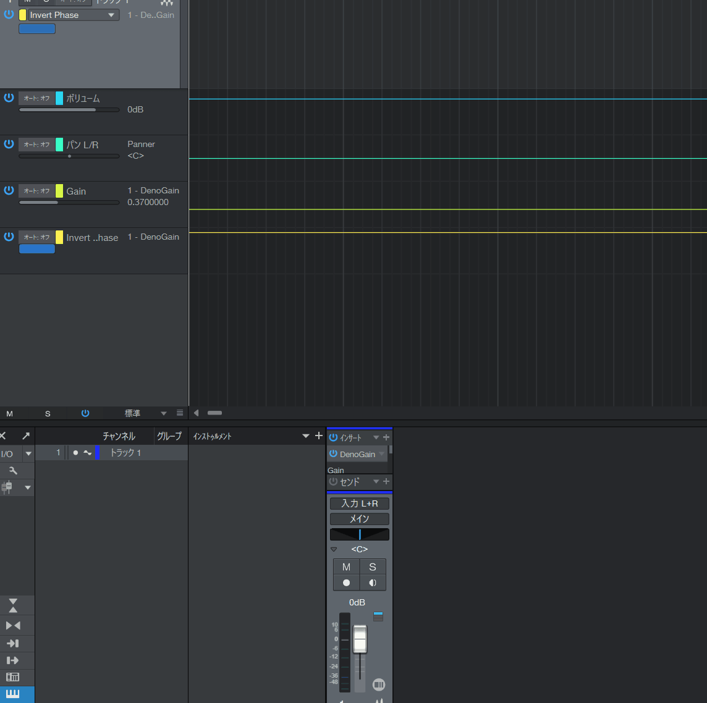

# audio-plugin-web-ui
This is an example of implementing a graphical user interface for audio plugin with web technology stack.

## Motivation

To introduce a method for creating the GUI of audio plugins using web technologies by combining JUCE and CHOC. This approach enables flexible and effective GUI prototyping, incorporating multiple technological elements.

## Examples

In this repository, you can build two audio plugins named WebGain and DenoGain.

### WebGain

It seamlessly integrate a single HTML file as C++ binary data into projects. The controller utilizes the input elements of HTML, p5.js is used for background rendering, CSS animations are used for animations of HTML elements, and the graphical user interface (GUI) is constructed.


### DenoGain

It utilizes a technology stack commonly used in web frontend development, including Vite, Deno, Svelte, and TypeScript. It ensures the ability to render web resources generated by the build system for distribution and retrieve web resources from a development server. In this program, the provision of web resources involves implementing a simple web server-like function using the CHOC API, and the resources are streamed to the WebView based on Fetch calls from the WebView.



## How to build

### Prerequisites

In general, having a setup that allows building JUCE should be sufficient. If possible, it's reassuring to verify whether the JUCE DemoRunner can be successfully built.

+ Visual Studio: 2022 (Windows)
+ Xcode: 14.2 or later (macOS)
+ Clnag: 14 or later (Linux)
+ Ninja-build: 1.11 or later (Linux)
+ CMake: 3.25 or later
+ Git: 2.3 or later
+ Deno: 1.42 or later

### Run build scripts

#### Cross-Platform shell-script by Deno

Deno:
```sh
deno run --allow-all ./Scripts/deno/build-with-cmake.ts
```

#### Platform native shell-script

There are scripts for each platform, so please run the following command.

Windows:
```bat
.\Scripts\build_windows_msvc2022.bat
```

macOS:
```sh
./Scripts/build_macos_xcode.sh
```

Linux:
```sh
./Scripts/build_linux_ninja.sh
```

## How to install

#### Cross-Platform shell-script by Deno

Deno(Windows):
In windows, run shell with administrator rights.
```sh
# Install VST3 plugins.
deno run --allow-all ./Scripts/deno/install-vst3-with-cmake.ts

# Install CLAP plugins.
deno run --allow-all ./Scripts/deno/install-clap-with-cmake.ts
```

Deno(macOS, Linux):
```sh
# Install VST3 plugins.
sudo deno run --allow-all ./Scripts/deno/install-vst3-with-cmake.ts

# Install CLAP plugins.
sudo deno run --allow-all ./Scripts/deno/install-clap-with-cmake.ts
```

#### Platform native shell-script

There are scripts for each platform, so please run the following command.

Windows:
```bat
@REM Install VST3 plugins.
.\Scripts\install_windows_msvc2022_vst3.bat

@REM Install CLAP plugins.
.\Scripts\install_windows_msvc2022_clap.bat
```

macOS: under construction.

Linux: under construction.

## Attention Regarding Licenses

If you are using this project to create and distribute software, please ensure compliance with the licenses of the following software libraries:

+ [JUCE](https://github.com/juce-framework/JUCE)  
+ [CHOC](https://github.com/Tracktion/choc)  
+ [clap-juce-extensions](https://github.com/free-audio/clap-juce-extensions)  
